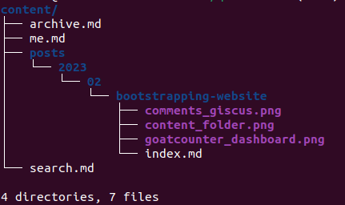

# TL;DR

This article goes throught all the details in order to explain how setup a blogfolio
like this one
- From article posting using simple Markdown syntax 🔤
- To deployment on Github Pages 🚀, with Giscus comments on each articles 🗣️
- To monitoring of engagement using Goatcounter 📶

Keep reading for more !

## Introduction

I'm currently starting this blogfolio to expose my work on the internet and to kick off some content on this blog about fun details I'v come accross exploring topics. It is basically a web hosted memo, but I hope it could help others tech-hobbyist exploring stuff too !

To start a first with some technical details on this fresh new website, It might be a good start to
deep dive under explaining how this website is generated, from creation to deployment.

The dilemna of 🥚 VS 🐔 remains but at least we could get details of how things are done. 😃

Let's go !

## Making this kind of website - A simple HowTo

This website is made public using the fancy tool of [Github Pages](https://pages.github.com/)
and the behind the scenes are curated by [Hugo](https://gohugo.io/).

### Install Hugo

The first setup of hugo is easy, install it following guidelines from previous website based on your OS.

For me, as I enjoy using an Ubuntu workstation :

```sh
sudo snap install hugo
```

Create template for your new website 🚀, launching it with

```sh
hugo new site <name of site> -f yml
```

Make a fork of your favorite Hugo theme 🌟, and then add it as a submodule it under your theme folder

```sh
git submodule add --depth=1 https://github.com/<yourGHuser>/hugo-PaperMod.git themes/PaperMod
git submodule update --init --recursive
```
Later, you can update layouts and customize the theme under your own repo in this git submodule.

Finally add in `config.yml`:
```yaml
theme: "PaperMod"
```

Cutomize to your liking your blog :
- Add a search and archive page
- Add a presentation page
- tweak the `assets/css/extended/themes-vars-override.css` to get a color palette at your liking
- Modify options under `config.yml` to enable or disable features

**You would like to add some comment system ?**
1. Create a "Discussions" category under your Github repository discussion tab. (Using "Announcements" is a good practice, as explained by <cite>Chris Wilson[^1]</cite>)
[^1]: The "Announcements" category allows only Maintainers and Giscus Bot to create Discussions, which is better. Explained under this blog [post](https://cdwilson.dev/articles/using-giscus-for-comments-in-hugo/)
2. Have a look at [Giscus](https://giscus.app/), answer the configuration questions and then
paste the script under `layouts/partials/comments.html`. Do not forget to set `comments: true` under `config.yml`
3. Now you have a fancy comment system ! 


**What about a monitoring dashboard ?**
1. Sign up at [Goatcounter.com](https://www.goatcounter.com/), and copy the code snippet under the file `layouts/extend_footer.html`

```html
<script data-goatcounter="https://<yoursitename>.goatcounter.com/count"
        async src="//gc.zgo.at/count.js"></script>
```
2. Go to your dashboard at [https://yoursitename.goatcounter.com](https://www.goatcounter.com/) and watch traffic incoming. If you do not see any peak, disable your adblocker.
3. Now you can monitor the number of views of your posts ! 


### Create some content

I will organize my posts under a folder, split per year and month as it is displayed under archive page.


To quickly kick-off content use this script under `script` folder. Inspired from <cite> Nicholas Gilbert[^2]</cite>

[^2]: The script is made by Nicholas Gilbert and exposed in his excellent [article](https://gilbertdev.net/posts/2023/02/enter-automation/).

```bash
#!/bin/bash
printf -v year '%(%Y)T' -1
printf -v month '%(%m)T' -1

hugo new --kind post posts/$year/$month/$1/index.md
```

So basically, next time you see a new blog post, it's just a markdown containing notes
samples, which is commited on my personnal repo on [Github](https://github.com/Emilien-Foissotte/emilien-foissotte.github.io).

I can trigger an new post writing with this command

```sh
./scripts/make-post.sh new-fancy-idea
```

### Deploy to your new website

Each time a commit reach `main`
branch, Github Action trigger some pipelines to build and deploy it.

You can see all details about the various step under `.github/workflows/hugo.yaml`

```yaml {linenos=true}
# Sample workflow for building and deploying a Hugo site to GitHub Pages
name: Deploy Hugo site to Pages

on:
  # Runs on pushes targeting the default branch
  push:
    branches:
      - main

  # Allows you to run this workflow manually from the Actions tab
  workflow_dispatch:

# Sets permissions of the GITHUB_TOKEN to allow deployment to GitHub Pages
permissions:
  contents: read
  pages: write
  id-token: write

# Allow one concurrent deployment
concurrency:
  group: "pages"
  cancel-in-progress: true

# Default to bash
defaults:
  run:
    shell: bash

jobs:
  # Build job
  build:
    runs-on: ubuntu-latest
    env:
      HUGO_VERSION: 0.111.2
    steps:
      - name: Install Hugo CLI
        run: |
          wget -O ${{ runner.temp }}/hugo.deb https://github.com/gohugoio/hugo/releases/download/v${HUGO_VERSION}/hugo_extended_${HUGO_VERSION}_linux-amd64.deb \
          && sudo dpkg -i ${{ runner.temp }}/hugo.deb
      - name: Install Dart Sass Embedded
        run: sudo snap install dart-sass-embedded
      - name: Checkout
        uses: actions/checkout@v3
        with:
          submodules: recursive
          fetch-depth: 0
      - name: Setup Pages
        id: pages
        uses: actions/configure-pages@v3
      - name: Install Node.js dependencies
        run: "[[ -f package-lock.json || -f npm-shrinkwrap.json ]] && npm ci || true"
      - name: Build with Hugo
        env:
          # For maximum backward compatibility with Hugo modules
          HUGO_ENVIRONMENT: production
          HUGO_ENV: production
        run: |
          hugo \
            --gc \
            --minify \
            --baseURL "${{ steps.pages.outputs.base_url }}/"
      - name: Upload artifact
        uses: actions/upload-pages-artifact@v1
        with:
          path: ./public

  # Deployment job
  deploy:
    environment:
      name: github-pages
      url: ${{ steps.deployment.outputs.page_url }}
    runs-on: ubuntu-latest
    needs: build
    steps:
      - name: Deploy to GitHub Pages
        id: deployment
        uses: actions/deploy-pages@v1
```

Basically Github will handle :

1. Build the static sites using job at line 31, generating pages for each article.
2. Deploy it using GitHub Pages environment, using job definition at line 68.

## Conclusion

Hugo is a pretty fun framework to use, and well integrated with Github and other tools.
Basically writing some contents is just about kicking-off some Markdown which make the
release cycle so simple !

If you wish to record you blog under other Open Source ones, not hosted under a private
solution like Medium or Substack, go to [diff.blog](https://diff.blog/)  

Thanks to all other bloggers for exposing their works, it makes life so much easier but doesn't trade off
under the Open Sourceness of solutions.

Happy to see other Open Source and Ad free blog around 😊
