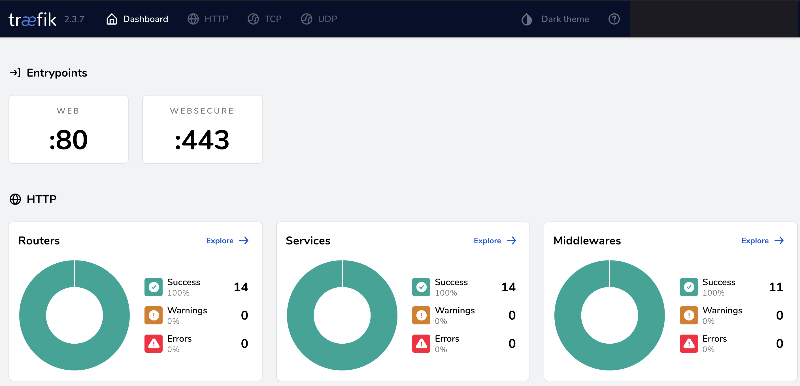

## TL;DR

Dans ce billet de blog post nous allons voir comment mettre en place un
système monitoré 📊 & sécurisé de stockage cloud personel ⏏️,
hébergé derrière un proxy ⚙️, afin que vous puissez exposer plein d'autres services
sur votre serveur personnel 🏠

Délaissez Google Drive et Google Photos 📷, hébergez vos beaux pixels chéris directement
chez vous 🚀 !

## Intro

Ma copine a fait récemment face à une situation très stressante, laissez moi vous expliquer
birèvement la cause du problème 😬


Elle adore, tout comme moi, prendre un tas de photos durant ses voyages et immortaliser
les moments de tous les jours. Par chance, Google a rendu possible avec son application Google Photo
la sauvegarde et le partage massif de ses photos à ses proches & amis, depuis son smartphone en un
claquement de doigt ! Et bonus, à la clé, on peut même partagé un album commun.
Il faut le dire, c'est incroyable !



Néanmoins, plus le temps avançait, la quantité de photo a dépassé la limite gratuite, et
face à cela nous n'avons pas trouvé acceptable de débourser quelques euros tous les mois pour ce
service (sutout quand on sait qu'en donnant ces photos "gratuitement", on laisse à Google un très joli
dataset de photos qui peut être utilisé pour faire des applications ML et CV), afin d'augmenter
la limite de stockage.

Et le pire dans tout cela, c'est que comme il n'y a pas d'isolation entre
Drive, Photos et GMail, alors Google envoyait constamment des notifications sur
le téléphone, pour dire qu'il n'arrivait plus à recevoir les mails, faute d'espace.
Cela rend la situation assez critique, quand on utilise cet email comme contact principal
(pour réserver les billets de train et d'avion, pour son application bancaire, pour les factures)

_Dans la tête d'un nouvel email 📧 arrivant sur une boîte Gmail quasi-pleine_ 🤣 :


L'esprit "craftsmanship" m'a susuré l'idée d'utiliser l'excellente
Raspberry Pi que je possède déjà à la maison pour streamer Films&Séries( [Abonnement Plex](https://www.plex.tv/)
solution incroyable, là aucun scrupule pour chaque € déboursé), mais cette fois en
pour héberger photos et fichiers perso !

Voici un petit schéma du système :


graph TB
linkStyle default fill:#ffffff

subgraph diagram [System Landscape]
style diagram fill:#ffffff,stroke:#ffffff

    1["<div style='font-weight: bold'>Managed Users</div><div style='font-size: 70%; margin-top: 0px'>[Person]</div>"]
    style 1 fill:#dddddd,stroke:#9a9a9a,color:#000000
    16["<div style='font-weight: bold'>Smartphone</div><div style='font-size: 70%; margin-top: 0px'>[Software System]</div>"]
    style 16 fill:#dddddd,stroke:#9a9a9a,color:#000000
    2["<div style='font-weight: bold'>Grafana</div><div style='font-size: 70%; margin-top: 0px'>[Software System]</div>"]
    style 2 fill:#dddddd,stroke:#9a9a9a,color:#000000
    3["<div style='font-weight: bold'>Cloud Storage external Provider (Uptobox)</div><div style='font-size: 70%; margin-top: 0px'>[Software System]</div>"]
    style 3 fill:#dddddd,stroke:#9a9a9a,color:#000000
    4["<div style='font-weight: bold'>RaspberryPI</div><div style='font-size: 70%; margin-top: 0px'>[Software System]</div>"]
    style 4 fill:#dddddd,stroke:#9a9a9a,color:#000000

    1-. "<div>Manage personal data throught<br />computer</div><div style='font-size: 70%'></div>" .->4
    4-. "<div>is replicated (CRON)</div><div style='font-size: 70%'></div>" .->3
    2-. "<div>Display and monitor system<br />info</div><div style='font-size: 70%'></div>" .->4
    4-. "<div>Display and share data</div><div style='font-size: 70%'></div>" .->16
    16-. "<div>Upload to backup data</div><div style='font-size: 70%'></div>" .->4
    1-. "<div>Manage personal data throught<br />smartphone</div><div style='font-size: 70%'></div>" .->16

end


Et la vue détaillée du conteneur "RaspberryPI" ( exprimé dans le
[modèle C4](https://c4model.com/) )

graph TB
linkStyle default fill:#ffffff

subgraph diagram [RaspberryPI - Containers]
style diagram fill:#ffffff,stroke:#ffffff

    1["<div style='font-weight: bold'>Managed Users</div><div style='font-size: 70%; margin-top: 0px'>[Person]</div>"]
    style 1 fill:#dddddd,stroke:#9a9a9a,color:#000000
    3["<div style='font-weight: bold'>Cloud Storage external Provider (Uptobox)</div><div style='font-size: 70%; margin-top: 0px'>[Software System]</div>"]
    style 3 fill:#dddddd,stroke:#9a9a9a,color:#000000

    subgraph 4 [RaspberryPI]
      style 4 fill:#ffffff,stroke:#9a9a9a,color:#9a9a9a

      5["<div style='font-weight: bold'>NextCloudPi Web Application</div><div style='font-size: 70%; margin-top: 0px'>[Container]</div>"]
      style 5 fill:#dddddd,stroke:#9a9a9a,color:#000000
      6["<div style='font-weight: bold'>Database</div><div style='font-size: 70%; margin-top: 0px'>[Container]</div>"]
      style 6 fill:#dddddd,stroke:#9a9a9a,color:#000000
      7["<div style='font-weight: bold'>HDD1</div><div style='font-size: 70%; margin-top: 0px'>[Container]</div>"]
      style 7 fill:#dddddd,stroke:#9a9a9a,color:#000000
      8["<div style='font-weight: bold'>HDD2</div><div style='font-size: 70%; margin-top: 0px'>[Container]</div>"]
      style 8 fill:#dddddd,stroke:#9a9a9a,color:#000000
    end

    5-. "<div>Store elements</div><div style='font-size: 70%'></div>" .->6
    6-. "<div>is mounted on</div><div style='font-size: 70%'></div>" .->7
    7-. "<div>is replicated (CRON)</div><div style='font-size: 70%'></div>" .->8
    7-. "<div>is replicated (CRON)</div><div style='font-size: 70%'></div>" .->3
    1-. "<div>Manage personal data throught<br />computer</div><div style='font-size: 70%'></div>" .->5

end


Évidemment la pression est un peu plus grande sur le système, il faut avoir des sauvegardes plus régulières
et ne pas déléguer cette charge à Google, mais je me sentais confiant et avais la soif d'apprendre
à mettre ça en place. De plus, ([Uptobox](https://uptobox.com/) peut me sauver la mise au cas où mes
HDD de la maison brûlaient ou venaient à être disfonctionnels.

Voici l'architecture à laquelle je suis parvenu, le système doit être bien isolé de l'OS avec
des conteneurs dockers pour la simplicité de déploiement/re-déploiement, des connections chiffrées avec
le SSL et HTTPS et enfin le système devait être 100% gratuit (chaleureux remerciements à l'équipe de
Nextcloud pour le travail incroyable).
La sauvegarde sera effectuée par synchronisation de disques durs locaux et stockée également sur mon
stockage Uptobox (le seul potentiel poste de dépense, en + du nom DNS, mais c'est à peine quelques euros
par mois et dans tous les cas j'aurais continué à pauyer pour ses services
que j'utilise déjà).

Pour monitorer toute l'architecture, un dashboard Grafana viendrait lire les métriques systèmes
régulièrement (CPU, RAM , espace disque restant, trafic réseau, docker uptimes)..

Voici une liste des composants utilisés :

- [NextCloudPi](https://github.com/nextcloud/nextcloudpi)
- [Grafana](https://grafana.com/)
- [Docker](https://www.docker.com/)
- [Let's encrypt](https://letsencrypt.org/)
- [Traefik](https://traefik.io/)

Tous ces graphes ont été générés en utilisant [Structurizr](https://structurizr.com),
dont voici l'architecture, exprimés dans le langage DSL de la modélisation C4 :

```txt
workspace "NextCloudPi" "Home Personnal Storage System" {

    model {
        u = person "Managed Users"
        monitoring = softwareSystem "Grafana"
        webcloudprovider = softwareSystem "Cloud Storage external Provider (Uptobox)"
        personnalcloudstorage = softwareSystem "RaspberryPI" {
            webapp = container "NextCloudPi Web Application"
            database = container "Database"
            physicalstorage = container "HDD1"
            physicalbackupstorage = container "HDD2"

            u -> webapp "Manage personal data throught computer"
            webapp -> database "Store elements"
            database -> physicalstorage "is mounted on"
            physicalstorage -> physicalbackupstorage "is replicated (CRON)"
            physicalstorage -> webcloudprovider "is replicated (CRON)"

        }
        client = softwareSystem "Smartphone"
        monitoring -> personnalcloudstorage "Display and monitor system info"
        personnalcloudstorage -> client "Display and share data"
        client -> personnalcloudstorage "Upload to backup data"
        u -> client "Manage personal data throught smartphone"

    }

    views {

    }

}
```

Maintenant que les bases de l'architecture ont été posées, on peut réfléchir au
déploiement et développement de la solution !

## Déploiement de la solution

### Pare-feu

La première chose très importante à faire, c'est de sécuriser notre Raspberry Pi
exposée sur internet, avec [ufw](https://doc.ubuntu-fr.org/ufw) et
[fail2ban](https://doc.ubuntu-fr.org/fail2ban).
Comme notre pi sera directement accessible depuis internet (pour le confort d'un accès en SSH depuis l'
extérieur en cas de besoin), il est important de mettre en place un bon pare-feu.
En effet, il faut à tout prix éviter les attaques par bruteforce, les attaques de type "Fuzzers" et
toutes les choses effrayantes qui peuvent atteindre votre Pi.
(Ne craignez rien, avec un bon mot de passe et un banissement efficace des IPs incriminées
, vous êtes à l'abri de la plupart des attaques de bots)

Commencons par installer le paquet fail2ban

`sudo apt-get update && apt-get install fail2ban`

Lancez et vérifiez le status de fail2ban

`sudo systemctl start fail2ban && sudo systemctl
enable fail2ban && sudo systemctl status fail2ban`

Créer le fichier de configuration par défaut pour la prison d'IPs en modifiant
ce fichier `/etc/fail2ban/jail.d/custom.conf`.

Attention, ajoutez ici quelques IPs que vous n'inclurez pas dans la prison,
pour éviter de vous auto-bloquer en cas d'erreurs successives de mot de passe.

```
[DEFAULT]
ignoreip = 127.0.0.1 124.32.5.48
findtime = 10m
bantime = 24h
maxretry = 3
```

Rapide explication du fichier : Si une IP échoue à 3 reprise à se
connecter en SSH suite à un mauvais mot de passe durant les 10
dernières minutes, elle va en prison pour 24h ☠️

La prison va surveiller l'activité du démon ssh, sshd, grâce à votre
modification de ce fichier `/etc/fail2ban/jail.d/custom.conf`

```
[sshd]
enabled = true
```

Relancez la configuration de fail2ban pour appliquer les modifications :

`sudo systemctl restart fail2ban`

Désormais il est beaucoup plus difficile de s'introduire sur le système,
beau boulot 😈

Voici un petit aperçu de ma propre prison en place
au moment où j'écris ces lignes (attendez quelques minutes sur votre
serveur pour voir l'énorme quantité de bots être bloqués dans votre cas, c'est dingue)

`sudo fail2ban-client get sshd banip --with-time`

Regardez toutes ces misérables IPs malveillantes bloquées !!

```txt
45.136.153.217  2023-07-28 19:27:25 + 86400 = 2023-07-29 19:27:25
134.122.88.190  2023-07-29 02:07:52 + 86400 = 2023-07-30 02:07:52
193.35.18.169   2023-07-29 02:26:39 + 86400 = 2023-07-30 02:26:39
170.64.187.84   2023-07-29 04:06:54 + 86400 = 2023-07-30 04:06:54
159.203.46.152  2023-07-29 04:20:42 + 86400 = 2023-07-30 04:20:42
45.129.14.64    2023-07-29 04:27:53 + 86400 = 2023-07-30 04:27:53
5.187.112.81    2023-07-29 07:05:13 + 86400 = 2023-07-30 07:05:13
116.110.84.51   2023-07-29 14:19:34 + 86400 = 2023-07-30 14:19:34
45.128.232.71   2023-07-29 15:03:22 + 86400 = 2023-07-30 15:03:22
```


Ajoutez aussi une règle NAT avec le port 22 sur votre routeur,
si vous ne l'avez pas déjà fait, afin de rendre votre serveur accessible depuis Internet.

En guise de sécurité supplémentaire, j'active ufw sur ma RaspberryPI pour éviter
un traffic inattendu en cas de problème de configuration sur des ports non maîtrisés, même s'ils
sont fermés sur le routeur et non reliés, c'est une sécurité supplémentaire.

Installez ufw avec :

```sh
sudo apt install ufw
```

Activer le protocole ssh sur la route 22 avant d'appliquer le pare-feu,
sinon vous rendrez votre Pi complètement injoignable à distance par Ethernet/Wifi 😂:

```sh
sudo ufw allow ssh
```


Activez le pare-feu :

```sh
sudo ufw enable
```

### Reverse Proxy avec Docker

L'utilisation du reverse proxy, Traefik, est très simple. Tout ce qu'il faut faire c'est
appliquer les bons tags depuis les services docker-compose et traefik va surveiller ce qui se passe
sur le socket du démon docker et prendre tout en charge. Vous n'avez rien besoin de faire en plus,
c'est très puissant et évolutif !

Créons d'abord le réseau docker qui servira d'intermédiaire pour communiquer entre les services.

```sh
docker network create pi
```

Pour activer Traefik, nous activerons d'abord le service Docker de traefik. Pour cela, instancions un
le fichier docker-compose suivant :

```yaml
version: '3.4'
services:
  traefik:
      image: 'traefik:2.3'
          container_name: 'traefik'
    restart: 'unless-stopped'
    ports:
      - '80:80'
      - '443:443'
      - '8080:8080'
    volumes:
      - '/var/run/docker.sock:/var/run/docker.sock:ro'
      - './traefik/traefik.toml:/etc/traefik/traefik.toml:ro'
      - './traefik/traefik_dynamic.toml:/traefik_dynamic.toml:ro'
      - './ssl:/etc/ssl:ro'
    networks:
      - pi

  whoami:
    image: 'traefik/whoami'
    restart: 'unless-stopped'
    labels:
      - 'traefik.enable=true'
      - 'traefik.http.routers.whoami.rule=PathPrefix(`/whoami{regex:$$|/.*}`)'
      - 'traefik.http.services.whoami.loadbalancer.server.port=80'
      - 'traefik.http.routers.whoami.tls'
    networks:
      - pi

networks:
  pi:
    external: true
```

Nous allons ensuite configurer traefik avec 2 fichiers (pour activer la journalisation, le
dashboard de supervision et l'écoute sur le socket du démon docker).

Voici le contenu de notre fichier à placer sous `traefik/traefik.toml` :

```yaml
[entryPoints]
  [entryPoints.web]
    address = ":80"

  [entryPoints.websecure]
    address = ":443"

[api]
  dashboard = true

[providers.docker]
  watch = true
  network = "web"
  exposedByDefault = false

[providers.file]
  filename = "traefik_dynamic.toml"

[accessLog]
```

Nous définissons ici :

- 2 entrypoints, sur le port 80 pour le protocole HTTP, et un accès en HTTPS sur le port 443
- L'activation du dashboard super cool de traefik, accessible à [http://yoururl.com/dashboard/](),
  (_NB: Prenez garde à inclure le dernier slash final, c'est important sinon vous ne verez pas votre
  dashboard._)
- L'activation de l'écoute du socket docker, pour ajouter facilement de nouveau services
  tout en désactivant l'exposition des services si on ne l'a pas précisé par un label, (_meilleur d'un point de vue sécurité_)
- Un fichier de configuration `traefik_dynamic.toml`
- L'affichage des logs d'accès sur l'instance docker du reverse proxy

Super, désormais notre service traefik permet de faire le proxy depuis les points d'accès `websecure` et
`web`. Sécurisons le dashbaord de visualisation Traefik en générant et en demandant un mot de passe par
l'intermédiaire d'un `middleware` devant notre service.

```sh
sudo apt-get install apache2-utils
```

Générez un hash de votre mot de passe d'administration, en affichant le résultat sur la
sortie standard:

```sh
htpasswd -Bnb admin superpassword123
```

Voici la configuration dynamique configuration, référençant le middleware avec une basic auth :

```yaml
[http.middlewares.simpleAuth.basicAuth]
  users = [
    "admin:$2y$05$fJ.OOvXhMrXSC4s6uDgtp.q320RmTyHQ7iuya90TKS./LXa5QoJue"
  ]

[http.routers]
  [http.routers.unsecurerouter-api]
    rule = "Host(`192.168.X.X`) || Host(`yoururl.fr`) && (PathPrefix(`/api`) || PathPrefix(`/dashboard`))"
    entrypoints = ["web"]
    middlewares = ["simpleAuth"]
    service = "api@internal"

  [http.routers.securerouter-api]
    rule = "Host(`192.168.X.X`) || Host(`yoururl.fr`) && (PathPrefix(`/api`) || PathPrefix(`/dashboard`))"
    entrypoints = ["websecure"]
    middlewares = ["simpleAuth"]
    service = "api@internal"
    [http.routers.securerouter-api.tls]

[[tls.certificates]]
    certFile = "/etc/ssl/ssl-cert-snakeoil.pem"
    keyFile = "/etc/ssl/ssl-cert-snakeoil.key"
```

Nous y définissons :

- Un `middleware` en utilisant le hash précédemment généré avec le mot de passe de l'utilisateur admin
- Quelques `routers` pour rediriger les chemins d'URL commençant par `/dashboard` vers le dashboard
- Un `router` sécurisé et non sécurisé , le sécurisé utilisant les certificats stockés sous `/etc/ssl`
  (Nous y reviendrons au moment où nous allons générer ensemble le certificat avec Let's Encrypt)

Démarrons le service traefik , allez dans votre système de ficher jusqu'à votre `docker-compose.yml`,
à côté duquel vous avez enregistré les fichiers toml de configuration dynamique et statique.
Ajoutez aussi un dossier SSL vide.

```sh
docker-compose up -di
```

Ouvrez un navigateur web à [http://yoururl/dashboard/]() et vous devriez voir un
dashboard semblable à cela :



Bravo, bien joué, votre proxy fonctionne, et il est prêt à servir tous vos services!!


### Mise en place du monitoring avec Grafana

Maintenant nous allons déployer un dashboard Grafana également avec docker compose, tout en y ajoutant
quelques labels pour configurer le routage et le proxy avec traefik.
Vous pourrez ainsi monitorer votre serveur 24h/24h 7j/7j sans effort !

Pour cela, instanciez un fichier `docker-compose.yml` avec quelques services
dans un dossier `monitoring`.

Preparez en créant quelques sous-dossiers data (pour persister vos données si votre
serveur a besoin de redémarrer de temps à autre)

```sh
mkdir ~/monitoring && cd ~/monitoring && mkdir -p prometheus/data grafana/data && \
sudo chown -R 472:472 grafana/ && \
sudo chown -R 65534:65534 prometheus/
```

Voici le fichier docker-compose :

```yml
version: "3"
services:
  grafana:
    container_name: monitoring-grafana
    image: grafana/grafana:latest
    hostname: rpi-grafana
    restart: unless-stopped
    user: "472"
    networks:
      - pi
    expose:
      - 3000
    env_file:
      - ./grafana/.env
    volumes:
      # /!\ To be modified depending on your needs /!\
      - ./grafana/data:/var/lib/grafana
      - ./grafana/provisioning:/etc/grafana/provisioning
    depends_on:
      - prometheus
    labels:
      - "traefik.enable=true"
      - "traefik.http.routers.grafana.rule=PathPrefix(`/grafana{regex:$$|/.*}`)"
      - "traefik.http.routers.grafana.tls"
      - "traefik.http.services.grafana.loadbalancer.server.port=3000"
      - "traefik.frontend.headers.customRequestHeaders=Authorization:-"
      - "traefik.http.routers.grafana.middlewares=simpleAuth@file"

  cadvisor:
    container_name: monitoring-cadvisor
    image: zcube/cadvisor:latest
    hostname: rpi-cadvisor
    restart: unless-stopped
    privileged: true
    networks:
      - pi
    expose:
      - 8080
    devices:
      - /dev/kmsg
    volumes:
      - /:/rootfs:ro
      - /var/run:/var/run:rw
      - /sys:/sys:ro
      - /var/lib/docker/:/var/lib/docker:ro
      - /dev/disk/:/dev/disk:ro
      - /etc/machine-id:/etc/machine-id:ro

  node-exporter:
    container_name: monitoring-node-exporter
    image: prom/node-exporter:latest
    hostname: rpi-exporter
    restart: unless-stopped
    networks:
      - pi
    expose:
      - 9100
    command:
      - --path.procfs=/host/proc
      - --path.sysfs=/host/sys
      - --path.rootfs=/host
      - --collector.filesystem.ignored-mount-points
      - ^/(sys|proc|dev|host|etc|rootfs/var/lib/docker/containers|rootfs/var/lib/docker/overlay2|rootfs/run/docker/netns|rootfs/var/lib/docker/aufs)($$|/)
    volumes:
      - /proc:/host/proc:ro
      - /sys:/host/sys:ro
      - /:/rootfs:ro
      - /:/host:ro,rslave

  prometheus:
    container_name: monitoring-prometheus
    image: prom/prometheus:latest
    hostname: rpi-prometheus
    restart: unless-stopped
    user: "nobody"
    command:
      - "--config.file=/etc/prometheus/prometheus.yml"
      - "--storage.tsdb.path=/prometheus"
    networks:
      - pi
    expose:
      - 9090
    volumes:
      # /!\ To be modified depending on your needs /!\
      - ./prometheus/data:/prometheus
      - ./prometheus:/etc/prometheus/
    depends_on:
      - cadvisor
      - node-exporter
    links:
      - cadvisor:cadvisor
      - node-exporter:node-exporter

networks:
  pi:
    external: true
```

- **Prometheus** expose les métriques systèmes de la RaspberryPI (CPU, RAM...)
- **Node-exporter** envoie les métriques au système de monitoring (grafana)
- **Grafana** expose la donnée au travers du proxy traefik
- **cAdvisor** monitore les conteneurs Dockers sur la RaspberryPI

_NB: Attention, installez bien une version d'Ubuntu ARM 64 bit, sinon certains containers
ne serons pas disponibles !_

Montez la stack :

```sh
docker-compose up -d
```

Navigez jusqu'au dashboard grafana à [http://yoururl/grafana/]() et

- Ouvrez un autre onglet de navigteur et suivez cette url [Grafana.com Shared Dashboard](https://grafana.com/grafana/dashboards/19275-raspberry-pi-docker-monitoring-vef/)
- Cliquez sur `COPY ID to clipboard` ou `Download JSON`
- Allez sur votre propre dashboard à [http://yoururl/grafana/]() et clickez sur `Import` sous
  `Dashboard tab`
  
- Copiez l'ID et cliquez sur `Load` ou `Upload JSON file` avec le fichier téléchargé
- Cliquez sur `Load`

Et voilà 🔥

Vous devriez avoir maintenant sous vos yeux émerveillés ceci :


Plutôt cool n'est-ce pas ? Tous vos dockers sont monitorés et même votre petite RaspberryPI !


### Déployer NextcloudPi

Désormais, tout est prêt pour héberger Nextcloud sur votre RaspberryPI, préparons votre
disque dur que vous utiliserez comme stockage supplémentaire externe, c'est préférable plutôt
que le volume racine de votre Pi.

Cela permet de mieux isoler les différents stockage mais cela n'est pas obligatoire,
c'est à votre convenance, vous pouvez tout à fait décider de stocker tout sur le volume racine
si vous préférez ou que vous n'avez de stockage externe (prévoyez de la place tout de même).

Si vous utiliserez un disque dur externe (magnétique comme moi ou pas)
alors suivez le guide !

D'abord il faut identifier le disque à formatter( soyez attentif à ne pas vous tromper
et écraser le stockage d'autres disques par mégarde, vérifiez toujours la cible
lors des commandes avant d'appliquer quelque opération que ce soit !!)

```sh
lsblk
```

Voici un exemple de mon installation avec 2 HDD (un de 2 To et
un autre de 500 Gb one) attaché à ma RaspberryPI qui tourne sur SSD (grâce à ce
[powered USB hub](https://www.cdiscount.com/informatique/clavier-souris-webcam/atolla-hub-usb-3-0-alimente-adaptateur-usb-4-port/f-1070229-ato6974065410521.html)
).


```txt
NAME   MAJ:MIN RM   SIZE RO TYPE MOUNTPOINTS
sda      8:0    0 465.8G  0 disk
├─sda1   8:1    0   256M  0 part /boot/firmware
└─sda2   8:2    0 465.5G  0 part /
sdb      8:16   0   1.8T  0 disk
└─sdb1   8:17   0   1.8T  0 part
sdc      8:32   0 465.7G  0 disk
└─sdc1   8:33   0 465.7G  0 part
```

On peut désormais formatter le disque dur avec un système de fichier prenant en charge
les permissions utilisateurs etc..
Attention, tout ce qui est présent sur le disque sera supprimé lors de la manipulation !

Un exemple ici est en formattant la partition du disque avec le système de fichier ext4
(système de fichiers GNU/Linux)

```sh
sudo mkfs -t ext4 /dev/sdc1
```

Maintenant nous avons notre disque de prêt, éditons `fstab`, i.e. nous
allons indiquer à l'OS comment chaque disque doit être monté, et où.

Identifiez l'`UUID` de votre disque formatté, en lançant cette commande :

```sh
lsblk -f
```

Éditez le fichier pour entrer ces valeurs, en remplaçant l'UUID et la localisation cible
vers quelque chose d'explicite de votre choix :

```txt
UUID=THE-ADDRESS-GOES-HERE /mnt/directory/location ext4 defaults 0
```

Maintenant vous pouvez monter le disque dur (cette opération est
à faire uniquement là, cela fait automatiquement à chaque démarrage) :

```sh
fstab mount -a
```

Changez la propriété de la localisation système cible pour l'utilisateur
utilisé par Nextcloud dans l'image Docker :

```sh
sudo chown www-data:www-data -R /mnt/directory/location
```

Maintenant, comme on ne change pas une équipe qui gagne
instancions un autre fichier docker-compose pour lancer la stack NextcloudPi.

```yml
version: "3.4"
services:
  nextcloud:
        container_name: nextcloudpi
            image: ownyourbits/nextcloudpi
    ports:
      - 8880:80
      - 8443:443
      - 4443:4443
    volumes:
      - '/media/backup2to/ncp/:/data'
      - 'ssl/ssl-cert-snakeoil.pem:/etc/ssl/certs/ssl-cert-snakeoil.pem:ro'
      - 'ssl/ssl-cert-snakeoil.key:/etc/ssl/private/ssl-cert-snakeoil.key:ro'
    restart: unless-stopped
    command: 127.0.0.1
```

Mais, où est utilisé traefil ?
Il n'y en a pas besoin car nous utilisons le port `80` et `4443` en binding directement sur l'hôte
mais pas sur les `80` and `443`, donc votre server peut les utiliser
pour Traefik et continuer à héberger des tonnes d'autres services !

Pensez bien à ouvrir ces ports dans votre NAT pour autoriser le traffic depuis internet vers Traefik et NextcloudPi
Pas besoin de filtre ici, tout est sécurisé par votre stack Nextcloud et Traefik.

Récupérez le mot de pass d'administration avec la commande `ncp-config` dans votre docker après
votre `docker-compose up -d` sur la stack.
Prenez le temps d'ajouter aussi votre nom de domaine DNS ou votre IP locale au dashboard,
dans `trusted-domains` sinon vous ne pourrez pas y accéder !

Téléchargez vos données depuis Google Photos avec [Google Takeout](https://support.google.com/accounts/answer/9666875?hl=fr).

Déchargez le contenu du zip dans votre dossier data de Nextcloud :

```sh
unzip 'takeout-yourzips-0*.zip' -d /media/backup2to/ncp/ncdata/data/yourusername/files/Photos/Takeout
```

Changer de nouveau la propriété des dossiers data et des photos copiées:

```sh
sudo chown www-data:www-data -R /mnt/directory/location/ncdata/data
```

Scannez le nouveau contenu :

```sh
docker exec -u 33 -it sh -c /var/www/nextcloud/occ files:scan --all
```

Si vous utilisez l'excellent app Nextcloud [Memories](https://memories.gallery/),
regenerez les métadata EXIF depuis vos nouvelles photos.

```sh
docker exec -u 33 -it sh -c /var/www/nextcloud/occ memories:migrate-google-takeout
```

Voici un aperçu de mon propre dashboard (flouté, vie privée oblige),
très sympa n'est-ce pas ?


Bravo, vous hébergez vos propres données à la maison désormais !! 🎊


Tout est presque terminé, il ne nous reste qu'à effecuter un DNS challenge
pour générer un certificat SSL wildcard (permettant d'accéder à n'importe quel root domain).

Vous ne transféreriez pas vos données, mots de passes, notes, agenda sur des connexions claires
non chiffrées ? Moi, non plus 😄

C'est parti pour activer le HTTPS sur traefik et nextcloud !

D'abord installons certbot sur notre RaspberryPI,

```sh
sudo apt update
sudo apt install certbot
```

Téléchargez le script du challenge acme et rendez-le executable :

```sh
wget https://github.com/joohoi/acme-dns-certbot-joohoi/raw/master/acme-dns-auth.py
chmod +x acme-dns-auth.py
```

Éditez les informations du script pour le lancer avec `python3`
Et déplacer le script vers le dossier de certbot :

```sh
sudo mv acme-dns-auth.py /etc/letsencrypt/
```

Lancez le acme-dns-certbot :

```sh
sudo certbot certonly --manual --manual-auth-hook /etc/letsencrypt/acme-dns-auth.py --preferred-challenges dns --debug-challenges -d \*.your-domain -d your-domain
```

Veillez à substituer le nom de domaine et à escaping l'asterix avec le backslash !

Regardez les logs de sortie, et ajoutez l'entrée DNS CNAME dans votre fournisseur DNS.
Un exemple de sortie :

```txt
Output
...
Output from acme-dns-auth.py:
Please add the following CNAME record to your main DNS zone:
_acme-challenge.your-domain CNAME 12345678-9abc-def0-1234-56789abcdef0.auth.acme-dns.io.

Waiting for verification...
...
```

Vous devez ajouter l'entrée `CNAME 12345678-9abc-def0-1234-56789abcdef0.auth.acme-dns.io`.

Dès que le bot a détecté le changement de DNS et généré le certificat publique et privé
avec le wildcard certificates copiez-les le dossier ssl de traefik et de nextcloud.

Dans votre dossier `ssl` :

```txt
ssl
├── ssl-cert-snakeoil.key
└── ssl-cert-snakeoil.pem
```

Ajoutez ce router à votre instance traefik pour ajouter cette configuration dynamique.
Cela dit à traefik de servire ces services avec du SSL par HTTPS.
Traefik va également ré-écrire les URL pour utiliser le bon port, quand vous requêterez [yoururl/nextcloud]().

```toml
[http.middlewares]
  [http.middlewares.redirectnextcloud.redirectRegex]
    regex = "^http(s?)://yoururl.fr/nextcloud(.*)"
    replacement = "https://yoururl.fr:8443"

[http.routers]
  [http.routers.nextcloud]
    rule = "PathPrefix(`/nextcloud`)"
    entrypoints = ["websecure"]
    middlewares = ["redirectnextcloud"]
    service = "nextcloud"
    [http.routers.nextcloud.tls]

[http.services]
  [http.services.nextcloud.loadBalancer]
    [http.services.nextcloud.loadBalancer.healthCheck]
      path = "/"
      scheme = "https"
      hostname = "yoururl.fr"
      port = "8443"

```

Vous êtes désormais sur une communication chiffrée par SSL, sécurité et vie
privée respectée 😎


### Installation de clients de synchronisation sur Smartphones

Pour l'usage pratique jusque dans votre poche, vous pouvez installer des apps nextcloud clientes
sur Android (et Mac, non testé ?) pour uploader directement vos fichiers par les apps,
mais aussi y prendre des notes (Drive et Keep sont désormais caduques).

Voici les liens vers les applis Android :

- [Nextcloud](https://play.google.com/store/apps/details?id=com.nextcloud.client&pli=1)
- [Nextcloud Notes](https://play.google.com/store/apps/details?id=it.niedermann.owncloud.notes)

Pour synchroniser votre calendrier, vos tâches et vos contacts, utilisez Davx5

- [DAVX5 sur Play Store](https://play.google.com/store/apps/details?id=at.bitfire.davdroid&referrer=utm_source%3Dhomepage)
- [DAVX5 sur FStore](https://f-droid.org/packages/at.bitfire.davdroid/)

Pour utiliser et voir vos photos aussi efficacement que sur l'app Google Photos:

- [Photos](https://play.google.com/store/apps/details?id=com.nkming.nc_photos)

Vous pouvez vadrouiller, toutes vos données seront sécuriées dans votre foyer
et dispo dans votre poche à portée de main.

Pour faire l'installation des clients et le lien avec le serveur, suivez cette doc [Davx5](https://www.davx5.com/tested-with/nextcloud) and
[Nextcloud](https://docs.nextcloud.com/server/latest/user_manual/fr/groupware/sync_android.html)
Très efficace !

### Mettre en place une stratégie de sauvegarde sur le modèle 3-2-1


Maintenant que tout est prêt à la maison soyez d'avoir une sauvegarde efficace,
ne prenez pas le risque de tout perdre.
Suivons la règle 3-2-1 :

- Une sauvegarde à `3` endroits différents
- Sur au moins `2` volumes physiques séparés
- Avec au moins `1` copie stockée à distance (en cas de feu, catastrophe majeure)

Gardez en tête qu'une véritable sauvegarde est une sauvegarde que l'on peut restaurer.
Soyez sur de tester de temps à autre que vous arrivez à faire l'exercice de restauration et que
tout se passe bien (avec un docker-compose annexe sur différnts ports, très très simple).

Une solution très simple est d'utiliser la solution de backup
de `ncp-config` et de synchroniser le contenu produit vers un autre disque dur.

```sh
 sudo rsync -vlr --info=progress2 /media/principalstorage/ncp/backup.tar /media/storagebackup/ncp/backup.tar
```

En cas de problème avec le disque dur, l'autre disque contient les données, que l'on peut restaurer avec
`ncp-config`.

Chaque mois, j'upload une copie sur mon stockage personnel Uptobox, cela tient lieu de stockage distant.

Récupérez le zip produit, prêt à l'envoi, avec [uptobox-cli](https://github.com/vic-blt/uptobox-cli)
_NB: Utilisez les nameserver Cloudflare, parfois Uptobox est bloqué par les FAI_

Installez la CLI avec `npm install` et remplissez `config.js` avec vos credentials et mettez le champ premium
sur `1`.

Une fois fait, upload votre fichier et rendez le privé.

```sh
node /home/pi/uptobox-cli/index.js uploadFiles backupnextcloud.zip
```

## Conclusion

Bravo, vous avez désormais un système complètement résilient de sauvegarde pour vos documents, photos,
votre calendrier et vos contacts !

En plus, avec Traefik, vous pouvez brancher n'importe quelle autre service sur le port `80` et `443` très
facilement sur votre serveur, c'est l'histoire de quelques labels docker-compose.

Pour conclure, Grafana vous permet de visualisation instantannément l'état de votre Raspberry Pi et de
vos services conteneurisés, ainsi à tout moment vous savez si vous remplissez trop vos disques ou si un
service sature votre mémoire RAM.

Pensez à mettre en place un système de sauvegarde automatique régulier, jetez un oeil
à [CRON jobs](https://doc.ubuntu-fr.org/cron), vous gagnez un temps fou.

Comme tout est automatique, assurez vous simplement que le job n'est pas cassé et continue et essayez de temps
en temps de faire l'exercice de restauration, au cas où quelque chose tournait mal.
Je vous encourage aussi vivement à stocker vos docker-compose sur un système de suivi de version privé
comme Github, pour stocker vos IaC.

N'hésitez pas à partager en commentaire votre façon d'organiser le stockage de données chez vous, vous
avez peut-être choisi une solution que je ne connais pas. Avec votre NextcloudPi vous pouvez aussi
super facilement partager des albums à vos proches ou leur proposer d'héberger leurs photos.
C'est très facile à faire !

Essayez les apps mobiles "Notes" et "memories", c'est bluffant comme c'est efficace.
Vous pouvez tester une tonne d'autres app Nextcloud dans le panneau d'administration,
depuis un compte du groupe admin, jetez-y un oeil !

Partagez moi en commentaire vos astuces de sauvegarde, j'ai entendu parler d'autres systèmes (CajaOS)
mais je ne connais pas et serais ravi d'avoir vos retours.

À bientôt, et merci pour votre temps à me lire.

### Des sources et liens qui m'ont aidé dans la mise en place du système.

Un grand merci à tous les devs qui ont pu partager leurs astuces et recommendations !
❤️ à l'équipe de Nextcloud

- [Nextcloud Guide 2020](https://help.nextcloud.com/t/guide-to-getting-started-with-nextcloudpi-docker-in-2020/93396)

- [Let's Encrypt and SSL certificates](https://help.nextcloud.com/t/how-to-configure-lets-encrypt-with-closed-ports-80-and-443/126375)

- [Wildcard certificate](https://www.digitalocean.com/community/tutorials/how-to-acquire-a-let-s-encrypt-certificate-using-dns-validation-with-acme-dns-certbot-on-ubuntu-18-04)

- [Official Guide NextcloudPI](https://help.nextcloud.com/t/how-to-get-started-with-ncp-docker/126081)

- [Rsync guide](https://www.howtoforge.com/backing-up-with-rsync-and-managing-previous-versions-history#local-and-remote)
- [3-2-1 Model](https://framablog.org/2021/04/23/sauvegardez/)
